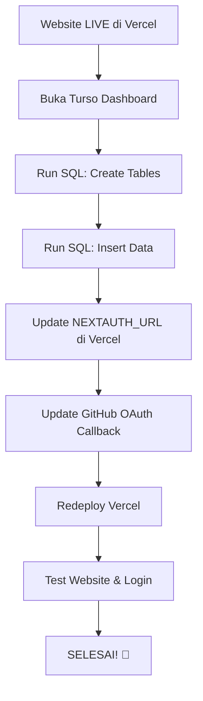

# 🎯 START HERE - Panduan Deploy Portfolio

> **Status**: Website SUDAH LIVE ✅ | Tinggal setup database (5-10 menit) ⏱️

---

## 📖 Dokumentasi Lengkap

### 🚀 Untuk Deploy (MULAI DI SINI!)

1. **[DEPLOY-SEKARANG.md](./DEPLOY-SEKARANG.md)** 👈 **BACA INI DULU!**
   - Panduan lengkap dengan emoji dan visual
   - Step-by-step super detail
   - Troubleshooting tips
   - **Recommended: Buka file ini dan ikuti langkah-langkahnya**

2. **[TURSO-SQL-SETUP.sql](./TURSO-SQL-SETUP.sql)** 📋
   - SQL yang perlu di-copy-paste ke Turso Console
   - Sudah dibagi jadi 2 step (create tables & insert data)
   - **Siap copy-paste, no edit needed!**

3. **[CHECKLIST-DEPLOY.md](./CHECKLIST-DEPLOY.md)** ✅
   - Checklist ringkas untuk dipantau
   - Format checkbox yang bisa di-check
   - Estimasi waktu per step

---

## 🎬 Alur Deploy (Ringkasan)



**Total waktu: 5-10 menit**

---

## 📚 Dokumentasi Referensi

### Untuk Cek Info Cepat

- **[QUICK-REFERENCE.md](./QUICK-REFERENCE.md)** 📌
  - Links penting (Turso, Vercel, GitHub)
  - Environment variables
  - Database schema
  - Tech stack info
  - Routes overview

### Untuk Deployment Technical Details

- **[DEPLOY-VERCEL.md](./DEPLOY-VERCEL.md)** 🔧
  - Complete technical guide
  - Architecture decisions
  - Deployment steps
  - Configuration details

---

## 🎯 Apa yang Sudah Dikerjakan?

✅ **Setup Lokal**
- React version fixed (18.3.1)
- Dependencies installed (636 packages)
- Local D1 database configured
- Dev server running

✅ **Admin Dashboard Lengkap**
- Full CRUD untuk Profile, Projects, Experience, Tech Stack
- GitHub OAuth authentication (username: dannel07)
- Toast notifications
- Delete confirmations
- CV management

✅ **Database Schema**
- 11 tabel dibuat dengan Drizzle ORM
- Timestamp fix (integer milliseconds)
- Foreign key relations
- Migrations ready

✅ **Vercel Deployment**
- Code pushed to GitHub
- Vercel project created & connected
- Build SUCCESSFUL ✅
- Website LIVE ✅
- Environment variables set
- Turso database connected

---

## 🔥 Apa yang Harus Dilakukan Sekarang?

❌ **Setup Database** (5 menit)
1. Buka Turso dashboard
2. Run SQL untuk create tables
3. Run SQL untuk insert sample data

❌ **Update URLs** (2 menit)
1. Update NEXTAUTH_URL di Vercel
2. Update GitHub OAuth callback URL

❌ **Test** (3 menit)
1. Redeploy Vercel
2. Test login dengan GitHub
3. Test CRUD operations

**TOTAL: ~10 menit untuk SELESAI!**

---

## 📁 File Structure

```
Portfolio/
├── 📄 START-HERE.md ← Kamu di sini sekarang
├── 📄 DEPLOY-SEKARANG.md ← Baca ini untuk deploy
├── 📄 TURSO-SQL-SETUP.sql ← Copy-paste SQL ini
├── 📄 CHECKLIST-DEPLOY.md ← Checklist untuk dipantau
├── 📄 QUICK-REFERENCE.md ← Info cepat
├── 📄 DEPLOY-VERCEL.md ← Technical guide
│
├── src/
│   ├── app/ ← Next.js pages & routes
│   ├── components/ ← React components
│   ├── lib/ ← Actions, auth, database
│   └── db/ ← Database schema
│
├── drizzle/ ← Database migrations
├── scripts/ ← Seed scripts
└── public/ ← Static files
```

---

## 🚦 Quick Start (3 Langkah)

### Langkah 1: Buka File Deploy
```
📂 Buka: DEPLOY-SEKARANG.md
👀 Baca dari atas sampai bawah
```

### Langkah 2: Ikuti Instruksi
```
✅ Centang setiap langkah di CHECKLIST-DEPLOY.md
🔍 Kalau bingung, lihat QUICK-REFERENCE.md
```

### Langkah 3: Test & Selesai!
```
🌐 Buka website production kamu
👤 Login dengan GitHub
🎉 PORTFOLIO ONLINE!
```

---

## 💡 Tips Penting

### ⚠️ Hal yang HARUS Dilakukan:
1. **Jalankan SQL di Turso** (STEP 1 lalu STEP 2, jangan balik!)
2. **Update NEXTAUTH_URL** dengan production URL (bukan localhost!)
3. **Update GitHub OAuth callback** dengan production URL
4. **Redeploy Vercel** setelah update environment variables

### ✅ Hal yang SUDAH Otomatis:
- Build process (Vercel handle)
- Database connection (sudah configured)
- Authentication flow (NextAuth.js)
- Auto-deploy dari GitHub push

### 🚫 Hal yang TIDAK Perlu:
- Install dependencies di production (Vercel handle)
- Run migrations manually (sudah run via SQL Console)
- Configure SSL/HTTPS (Vercel handle)
- Setup custom domain (optional, bisa nanti)

---

## 🎓 Belajar Lebih Lanjut

Setelah deploy selesai, kamu bisa:

### Customize Website
- Edit profile di Admin Dashboard
- Tambah projects kamu sendiri
- Update tech stacks
- Upload CV

### Development
- Clone repo ini untuk development
- Run `npm run dev` untuk local server
- Edit code dan push ke GitHub
- Auto-deploy ke Vercel!

### Add Features (Future)
- Custom domain
- Contact form
- Blog section
- Analytics dashboard
- SEO optimization

---

## 📞 Butuh Bantuan?

### Kalau Stuck di Step Tertentu:
1. Cek bagian "🆘 Kalau Error" di `DEPLOY-SEKARANG.md`
2. Screenshot error message
3. Beritahu di langkah mana stuck
4. Tanya ke saya!

### Kalau Ada Error:
- ❌ SQL Console error → Screenshot error & tunjukkan
- ❌ OAuth callback error → Cek URL di GitHub settings
- ❌ "no such table" → Pastikan SQL STEP 1 sudah run
- ❌ Cannot login → Redeploy Vercel setelah update URLs

---

## 🎊 Setelah Deploy Berhasil

### Share Portfolio Kamu!
```
🌐 Production URL: https://portfolio-kamu.vercel.app
📱 Mobile-friendly
⚡ Super fast loading
🔒 Secure dengan OAuth
```

### Auto-Deploy Setup
```
1. Edit code di local
2. git add . && git commit -m "update"
3. git push
4. Vercel auto-deploy! ✨
```

### Free Forever
```
✅ Vercel: Unlimited projects
✅ Turso: 9GB storage (500M reads/month)
✅ GitHub: Unlimited repos
💰 Total cost: $0/month
```

---

## 🏁 Ready?

**Langkah Pertama**: Buka file [DEPLOY-SEKARANG.md](./DEPLOY-SEKARANG.md)

**Estimasi Waktu Total**: 5-10 menit

**Difficulty**: Easy (copy-paste & click buttons)

**Hasil**: Portfolio website LIVE di internet! 🚀

---

**Let's go! Kamu bisa! 💪**
